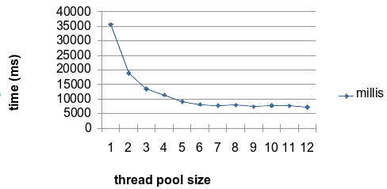

# JSON Transformation Engine Evaluation


One of the core functionalities of a solution I'm working on is to get a schema-less JSON document and apply a transformation (or a set of transformations) obtaining a new data structure.

Three different transformations were tested:

- [JOLT](https://github.com/bazaarvoice/jolt "JSON to JSON transformation library")
- [JSLT](https://github.com/schibsted/jslt "Query and transformation language for JSON") 
- [FreeMarker](https://freemarker.apache.org/ "Apache's FreeMarker template engine")

FreeMarker won on all criteria:

- easier and flexible template engine
- well adopted by the community
- well documented
- much faster than JSLT and at least as fast as JOLT

 ```bash
 *** 20,000 documents transformed ***
        jsltTest   = 1163 ms
        joltTest   =  653 ms    <--- second place
        freeMarker =  586 ms    <--- winner
 ```
 
The next step was to test how does FreeMarker scales. I used an Intel Core i7 8750H (2.20 - 4.10GHz) with 6 CPU cores (12 threads) computer:




It's pretty evident that, for this hardware and scenario, configure the thread pool with more than 4 or 5 threads is a waste of resources. But I have to consider that I'm only testing the transformation piece of code:

- it is computationally intensive
- it does not involves I/O at all

In real production cases, there will be a lot of I/O (_amqp, kafka_) and thus, a bigger thread pool size should help a lot.

Although it does not scales linearly (as expected, since concurrency plays a big role here), a _4-threaded pool_ was able to deliver a satisfactory result, transforming **90 thousand** documents per second.

In my tests, I worked with this transformation scenario:

#####Source document:

```json
{
  "user": {
  	"cpf": 102302007,
    "accounts": [
    	{ "key": "joe7@email.com", "type": "email" },
    	{ "key": "+551195533-0007", "type": "mobile",
    	  "contract": 92973478660007, "company": "038010401000123" },
    	{ "key": "joe7@my.company.com", "type": "email" },
    	{ "key": "joe7", "type": "corporate.id" }
    ],
    "products": [
    	{ "account": "joe7@email.com", "combo": "netflix", "variant": "family" },
    	{ "account": "joe7@my.company.com", "combo": "corporate/mobile",
    	  "roles": ["admin", "owner", "unused", "other"], "contract": 92973478662653,
    	  "company": "acme" },
    	{ "account": "joe7", "combo": "github", "account-type": "private", "roles": ["user"] }
    ],
    "signature": {
    	"owner": "joe7",
    	"pub": "VGhpcyBpcyBvbmx5IGEgdGVzdDogZG8gbm90IGV4cGVjdCB0byBmaW5kIGEgcmVhbCB2YWxpZCBwdWJsaWMga2V5IGhlcmUu"
    }
  }
}
```

#####Transformation template (freemarker):

```text
<#setting number_format="computer">
{
	"entries": [
	<#list user.accounts as e>
		<#assign options=false>
		{
			"id": "${e.key}",
			"_ref": ${user.cpf},
			"attribs": {
				<#list e as k,v>
					<#if k != "key">
						"${k}": "${v}"
						<#sep>,</#sep>
					</#if>
				</#list>
			},
			<#if user.signature?? && user.signature.owner == e.key>
				"pk": "${user.signature.pub}",
			</#if>
			"options": [
			<#if e.type == "mobile">
				<#assign options=true>
				"NOPASSWD"
			</#if>
			<#list user.products as p>
				<#if p.account == e.key && p.roles??>
					<#list p.roles as r>
						<#if r != "unused">
							<#if options>
								,
								<#assign options=false>
							</#if>
							<#if r == "admin">
								"MANAGER"
							<#else>
								"${r?upper_case}"
							</#if>
							<#assign options=true>
						</#if>
					</#list>
				</#if>
			</#list>
			]
		}
		<#sep>,</#sep>
	</#list>
	]
}
```

#####Expected result (output json):

```json
{
  "entries": [ {
    "id": "joe7@email.com",
    "_ref": 102302007,
    "attribs": {
      "type": "email"
    },
    "options": [ ]
  }, {
    "id": "+551195533-0007",
    "_ref": 102302007,
    "attribs": {
      "type": "mobile",
      "contract": "92973478660007",
      "company": "038010401000123"
    },
    "options": [ "NOPASSWD" ]
  }, {
    "id": "joe7@my.company.com",
    "_ref": 102302007,
    "attribs": {
      "type": "email"
    },
    "options": [ "MANAGER", "OWNER", "OTHER" ]
  }, {
    "id": "joe7",
    "_ref": 102302007,
    "attribs": {
      "type": "corporate.id"
    },
    "pk": "VGhpcyBpcyBvbmx5IGEgdGVzdDogZG8gbm90IGV4cGVjdCB0byBmaW5kIGEgcmVhbCB2YWxpZCBwdWJsaWMga2V5IGhlcmUu",
    "options": [ "USER" ]
  } ]
}
```

FreeMaker offers an [online testing resource](https://try.freemarker.apache.org/ "Try FreeMarker online") to speed up template development.
