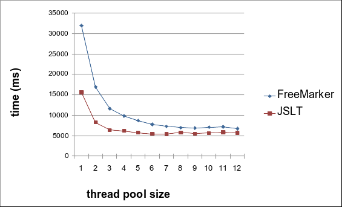

# JSON Transformation Engine Evaluation


One of the core functionalities of a solution I'm working on is to get a schema-less JSON document and apply a transformation (or a set of transformations) obtaining a new data structure.

Three different transformations were tested:

- [JOLT](https://github.com/bazaarvoice/jolt "JSON to JSON transformation library")
- [JSLT](https://github.com/schibsted/jslt "Query and transformation language for JSON") 
- [FreeMarker](https://freemarker.apache.org/ "Apache's FreeMarker template engine")

FreeMarker won on some criteria:
- large adoption
- well documented

JSLT won on performance and readability:
- faster than FreeMarker
- template is much more elegant

JOLT was discarded from comparison, since it was too clumsy to create a spec for our JSON example and after a while, I simply gave up: not JOLT's fault, just too far from my need.

In my first attempt I found that FreeMarker was faster than all other alternatives, but I made some mistakes in my test implementation. It was pointed me out by [Lars Garshol](https://github.com/larsga ""), that kindly checked my code, so I decided to explore JSLT more deeply.

Those are my new results for 1,000,000 json documents transformation:

```bash
*** 1,000,000 json transformed without ThreadPool ***
        jsltTest   = 11299 ms
        freeMarker = 34631 ms
```

```bash
*** 1,000,000 json transformed with ThreadPool (6 threads) ***
        jsltTest   =  3766 ms
        freeMarker =  8141 ms
```

Those results are not considering only the transformation itself since they also include my specific use case: input json and transformed documents will be received and sent as plain text. This means that all data conversions from and to string was part of the measured processing.


In my tests, I worked with this transformation scenario:

###Source document:

```json
{
  "user": {
  	"cpf": 102302007,
    "accounts": [
    	{ "key": "joe7@email.com", "type": "email" },
    	{ "key": "+551195533-0007", "type": "mobile",
    	  "contract": 92973478660007, "company": "038010401000123" },
    	{ "key": "joe7@my.company.com", "type": "email" },
    	{ "key": "joe7", "type": "corporate.id" }
    ],
    "products": [
    	{ "account": "joe7@email.com", "combo": "netflix", "variant": "family" },
    	{ "account": "joe7@my.company.com", "combo": "corporate/mobile",
    	  "roles": ["admin", "owner", "unused", "other"], "contract": 92973478662653,
    	  "company": "acme" },
    	{ "account": "joe7", "combo": "github", "account-type": "private", "roles": ["user"] }
    ],
    "signature": {
    	"owner": "joe7",
    	"pub": "VGhpcyBpcyBvbmx5IGEgdGVzdDogZG8gbm90IGV4cGVjdCB0byBmaW5kIGEgcmVhbCB2YWxpZCBwdWJsaWMga2V5IGhlcmUu"
    }
  }
}
```

###Transformation template (freemarker):

```text
<#setting number_format="computer">
{
	"entries": [
	<#list user.accounts as e>
		<#assign options=false>
		{
			"id": "${e.key}",
			"_ref": ${user.cpf},
			"attribs": {
				<#list e as k,v>
					<#if k != "key">
						"${k}": "${v}"
						<#sep>,</#sep>
					</#if>
				</#list>
			},
			<#if user.signature?? && user.signature.owner == e.key>
				"pk": "${user.signature.pub}",
			</#if>
			"options": [
			<#if e.type == "mobile">
				<#assign options=true>
				"NOPASSWD"
			</#if>
			<#list user.products as p>
				<#if p.account == e.key && p.roles??>
					<#list p.roles as r>
						<#if r != "unused">
							<#if options>
								,
								<#assign options=false>
							</#if>
							<#if r == "admin">
								"MANAGER"
							<#else>
								"${r?upper_case}"
							</#if>
							<#assign options=true>
						</#if>
					</#list>
				</#if>
			</#list>
			]
		}
		<#sep>,</#sep>
	</#list>
	]
}
```

###Transformation template (JSLT):

```text
let cpf = .user.cpf
let products = .user.products
let signature = .user.signature

{
   "entries":
   [for (.user.accounts)
      let key = .key
      let prd = [for ($products) . if ($key == .account)]
      let roles = flatten([for ($products) .roles if ($key == .account)])
      {
         "id": $key,
         "_ref": $cpf,
         "attribs": {
            for (.) .key: .value if (.key != "key")
         },
         "pk": if ($signature.owner == .key) $signature.pub else null,
         "options":
            [for (.) "NOPASSWD" if (.key == "type" and .value == "mobile")] +
            [for ($prd)
               "ADMIN" if (contains("admin", .roles))
            ] +
            [for ($roles)
               uppercase(.) if (. != "admin")
            ]
      }
   ]
}
```

###Expected result (output json):

```json
{
  "entries": [ {
    "id": "joe7@email.com",
    "_ref": 102302007,
    "attribs": {
      "type": "email"
    },
    "options": [ ]
  }, {
    "id": "+551195533-0007",
    "_ref": 102302007,
    "attribs": {
      "type": "mobile",
      "contract": "92973478660007",
      "company": "038010401000123"
    },
    "options": [ "NOPASSWD" ]
  }, {
    "id": "joe7@my.company.com",
    "_ref": 102302007,
    "attribs": {
      "type": "email"
    },
    "options": [ "MANAGER", "OWNER", "OTHER" ]
  }, {
    "id": "joe7",
    "_ref": 102302007,
    "attribs": {
      "type": "corporate.id"
    },
    "pk": "VGhpcyBpcyBvbmx5IGEgdGVzdDogZG8gbm90IGV4cGVjdCB0byBmaW5kIGEgcmVhbCB2YWxpZCBwdWJsaWMga2V5IGhlcmUu",
    "options": [ "USER" ]
  } ]
}
```

Both FreeMarker and JSLT offer online testing and development playground:
- [Online FreeMarker Template Tester](https://try.freemarker.apache.org/ "Try FreeMarker online")
- [JSTL Demo Playground](http://spt-data-dev-public-web.s3-website-eu-west-1.amazonaws.com/jstl2.html "JSLT Demo Playground")


## Scalability test

The next step was to test how does FreeMarker and JSLT scales. I used an Intel Core i7 8750H (2.20 - 4.10GHz) with 6 CPU cores (12 threads) computer:

**1,000,000 json submitted** (lower is better):




## Conclusions

### FreeMarker
It's pretty evident that, for this hardware and scenario, configure the thread pool with more than 6 threads is a waste of resources. But I have to consider that I'm only testing the transformation piece of code:

- computationally intensive
- not involves I/O at all

In real production cases, there will be a lot of I/O (_amqp, kafka_) and thus, a bigger thread pool size should help a lot.

Although it does not scales linearly (as expected, since concurrency, garbage collector and processor thermal throttling may play a big role here), a _6-threaded pool_ was able to deliver a satisfactory result, transforming **147k** documents per second.

Weaknesses:
- freeMarker does not handle separators on arrays, so I had to do that manually (using variables): not really nice to see.


### JSLT
JSLT does not seems to get expressive advantages from parallel processing with more than 3 threads, but it delivers real fast computation for my use case from the beginning.

Here happened the same as FreeMarker: more that 6 threads is not useful. But it was able to deliver a huge amount of documents: **185k** documents transformed with 6 threads pool.

Weaknesses:
- not found as far I could explore...


I'm surprised with JSLT and in just a couple of hours I was able to break my initial resistance to its template code style/syntax.

For my use case, **JSLT won the most important criteria**:
- it is faster
- template is readable and elegant
